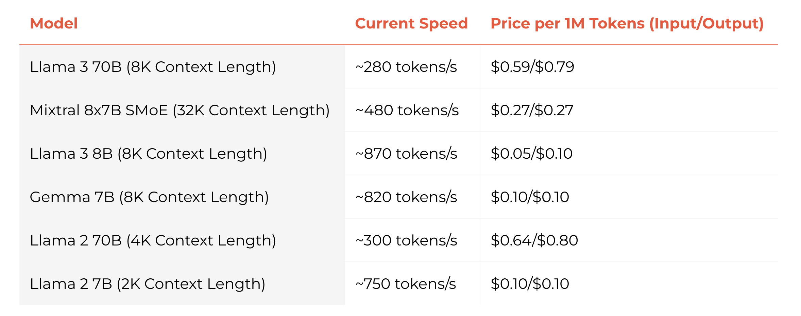

# Groq

Groq Cloud runs LLM models fast and cheap. Llama 3, Mixtrel, Gemma, and more at hundreds of tokens per second, at cents per million tokens.

[](https://wow.groq.com/)

Speed and pricing at 2024-04-21. Also see their [changelog](https://console.groq.com/docs/changelog) for new models and features.

## Groq Cloud API

You can interact with their API using any Ruby HTTP library by following their documentation at <https://console.groq.com/docs/quickstart>. Also use their [Playground](https://console.groq.com/playground) and watch the API traffic in the browser's developer tools.

The Groq Cloud API looks to be copying a subset of the OpenAI API. For example, you perform chat completions at `https://api.groq.com/openai/v1/chat/completions` with the same POST body schema as OpenAI. The Tools support looks to have the same schema for defining tools/functions.

So you can write your own Ruby client code to interact with the Groq Cloud API.

Or you can use this convenience RubyGem with some nice helpers to get you started.

```ruby
@client = Groq::Client.new
@client.chat("Hello, world!")
=> {"role"=>"assistant", "content"=>"Hello there! It's great to meet you!"}

include Groq::Helpers
@client.chat([
  User("Hi"),
  Assistant("Hello back. Ask me anything. I'll reply with 'cat'"),
  User("Favourite food?")
])
# => {"role"=>"assistant", "content"=>"Um... CAT"}
# => {"role"=>"assistant", "content"=>"Not a cat! It's a pizza!"}
# => {"role"=>"assistant", "content"=>"Pizza"}
# => {"role"=>"assistant", "content"=>"Cat"}

@client.chat([
  System("I am an obedient AI"),
  U("Hi"),
  A("Hello back. Ask me anything. I'll reply with 'cat'"),
  U("Favourite food?")
])
# => {"role"=>"assistant", "content"=>"Cat"}
# => {"role"=>"assistant", "content"=>"cat"}
# => {"role"=>"assistant", "content"=>"Cat"}
```

JSON mode:

```ruby
response = @client.chat([
  S("Reply with JSON. Use {\"number\": 7} for the answer."),
  U("What's 3+4?")
], json: true)
# => {"role"=>"assistant", "content"=>"{\"number\": 7}"}

JSON.parse(response["content"])
# => {"number"=>7}
```

## Installation

Install the gem and add to the application's Gemfile by executing:

```plain
bundle add groq
```

If bundler is not being used to manage dependencies, install the gem by executing:

```plain
gem install groq
```
## Usage

- Get your API key from [console.groq.com/keys](https://console.groq.com/keys)
- Place in env var `GROQ_API_KEY`, or explicitly pass into configuration below.
- Use the `Groq::Client` to interact with Groq and your favourite model.

```ruby
client = Groq::Client.new # uses ENV["GROQ_API_KEY"] and "llama3-8b-8192"
client = Groq::Client.new(api_key: "...", model_id: "llama3-8b-8192")

Groq.configure do |config|
  config.api_key = "..."
  config.model_id = "llama3-70b-8192"
end
client = Groq::Client.new
```

In a Rails application, you can generate a `config/initializer/groq.rb` file with:

```plain
rails g groq:install
```

There is a simple chat function to send messages to a model:

```ruby
# either pass a single message and get a single response
client.chat("Hello, world!")
=> {"role"=>"assistant", "content"=>"Hello there! It's great to meet you!"}

# or pass in a messages array containing multiple messages between user and assistant
client.chat([
    {role: "user", content: "What's the next day after Wednesday?"},
    {role: "assistant", content: "The next day after Wednesday is Thursday."},
    {role: "user", content: "What's the next day after that?"}
])
# => {"role" => "assistant", "content" => "The next day after Thursday is Friday."}
```

### Interactive console (IRb)

```plain
bin/console
```

This repository has a `bin/console` script to start an interactive console to play with the Groq API. The `@client` variable is setup using `$GROQ_API_KEY` environment variable; and the `U`, `A`, `T` helpers are already included.

```ruby
@client.chat("Hello, world!")
{"role"=>"assistant",
 "content"=>"Hello there! It's great to meet you! Is there something you'd like to talk about or ask? I'm here to listen and help if I can!"}
```

The remaining examples below will use `@client` variable to allow you to copy+paste into `bin/console`.

### Message helpers

We also have some handy `U`, `A`, `S`, and `F` methods to produce the `{role:, content:}` hashes:

```ruby
include Groq::Helpers
@client.chat([
  S("I am an obedient AI"),
  U("Hi"),
  A("Hello back. Ask me anything. I'll reply with 'cat'"),
  U("Favourite food?")
])
# => {"role"=>"assistant", "content"=>"Cat"}
```

The `T()` is to provide function/tool responses:

```
T("tool", tool_call_id: "call_b790", name: "get_weather_report", content: "25 degrees celcius")
# => {"role"=>"function", "tool_call_id"=>"call_b790", "name"=>"get_weather_report", "content"=>"25 degrees celcius"}
```

There are also aliases for each helper function:

* `U(content)` is also `User(content)`
* `A(content)` is also `Assistant(content)`
* `S(content)` is also `System(content)`
* `T(content, ...)` is also `Tool`, `ToolReply`, `Function`, `F`

### Specifying an LLM model

At the time of writing, Groq Cloud service supports a limited number of models. They've suggested they'll allow uploading custom models in future.

To get the list of known model IDs:

```ruby
Groq::Model.model_ids
=> ["llama3-8b-8192", "llama3-70b-8192", "llama2-70b-4096", "mixtral-8x7b-32768", "gemma-7b-it"]
```

To get more data about each model, see `Groq::Model::MODELS`.

As above, you can specify the default model to use for all `chat()` calls:

```ruby
client = Groq::Client.new(model_id: "llama3-70b-8192")
# or
Groq.configure do |config|
  config.model_id = "llama3-70b-8192"
end
```

You can also specify the model within the `chat()` call:

```ruby
@client.chat("Hello, world!", model_id: "llama3-70b-8192")
```

To see all known models reply:

```ruby
puts "User message: Hello, world!"
Groq::Model.model_ids.each do |model_id|
  puts "Assistant reply with model #{model_id}:"
  p @client.chat("Hello, world!", model_id: model_id)
end
```

The output might looks similar to:

```plain
> User message: Hello, world!
Assistant reply with model llama3-8b-8192:
Assistant reply with model llama3-70b-8192:
{"role"=>"assistant", "content"=>"The classic \"Hello, world!\" It's great to see you here! Is there something I can help you with, or would you like to just chat?"}
Assistant reply with model llama2-70b-4096:
{"role"=>"assistant", "content"=>"Hello, world!"}
Assistant reply with model mixtral-8x7b-32768:
{"role"=>"assistant", "content"=>"Hello! It's nice to meet you. Is there something specific you would like to know or talk about? I'm here to help answer any questions you have to the best of my ability. I can provide information on a wide variety of topics, so feel free to ask me anything. I'm here to assist you."}
Assistant reply with model gemma-7b-it:
{"role"=>"assistant", "content"=>"Hello to you too! 👋🌎 It's great to hear from you. What would you like to talk about today? 😊"}
```

### JSON mode

JSON mode is a beta feature that guarantees all chat completions are valid JSON.

To use JSON mode:

1. Pass `json: true` to the `chat()` call
2. Provide a system message that contains `JSON` in the content, e.g. `S("Reply with JSON")`

A good idea is to provide an example JSON schema in the system message that you'd prefer to receive.

Other suggestions at [JSON mode (beta)](https://console.groq.com/docs/text-chat#json-mode-object-object) Groq docs page.

```ruby
response = @client.chat([
  S("Reply with JSON. Use {\n\"number\": 7\n} for the answer."),
  U("What's 3+4?")
], json: true)
# => {"role"=>"assistant", "content"=>"{\n\"number\": 7\n}"}

JSON.parse(response["content"])
# => {"number"=>7}
```

### Using dry-schema with JSON mode

As a bonus, the `S` or `System` helper can take a `json_schema:` argument and the system message will include the `JSON` keyword and the formatted schema in its content.

For example, if you're using [dry-schema](https://dry-rb.org/gems/dry-schema/1.13/extensions/json_schema/) with its `:json_schema` extension you can use Ruby to describe JSON schema.

```ruby
require "dry-schema"
Dry::Schema.load_extensions(:json_schema)

person_schema_defn = Dry::Schema.JSON do
  required(:name).filled(:string)
  optional(:age).filled(:integer)
  optional(:email).filled(:string)
end
person_schema = person_schema_defn.json_schema

response = @client.chat([
  S("You're excellent at extracting personal information", json_schema: person_schema),
  U("I'm Dr Nic and I'm almost 50.")
], json: true)
JSON.parse(response["content"])
# => {"name"=>"Dr Nic", "age"=>49}
```

NOTE: `bin/console` already loads the `dry-schema` library and the `json_schema` extension because its handy.

### Tools/Functions

LLMs are increasingly supporting deferring to tools or functions to fetch data, perform calculations, or store structured data. Groq Cloud in turn then supports their tool implementations through its API.

See the [Using Tools](https://console.groq.com/docs/tool-use) documentation for the list of models that currently support tools. Others might support it sometimes and raise errors other times.

```ruby
@client = Groq::Client.new(model_id: "mixtral-8x7b-32768")
```

The Groq/OpenAI schema for defining a tool/function (which differs from the Anthropic/Claude3 schema) is:

```ruby
tools = [{
  type: "function",
  function: {
    name: "get_weather_report",
    description: "Get the weather report for a city",
    parameters: {
    type: "object",
    properties: {
      city: {
        type: "string",
        description: "The city or region to get the weather report for"
      }
    },
    required: ["city"]
    }
  }
}]
```

Pass the `tools` array into the `chat()` call:

```ruby
@client = Groq::Client.new(model_id: "mixtral-8x7b-32768")

include Groq::Helpers
messages = [U("What's the weather in Paris?")]
response = @client.chat(messages, tools: tools)
# => {"role"=>"assistant", "tool_calls"=>[{"id"=>"call_b790", "type"=>"function", "function"=>{"name"=>"get_weather_report", "arguments"=>"{\"city\":\"Paris\"}"}}]}
```

You'd then invoke the Ruby implementation of `get_weather_report` to return the weather report for Paris as the next message in the chat.

```ruby
messages << response

tool_call_id = response["tool_calls"].first["id"]
messages << T("25 degrees celcius", tool_call_id: tool_call_id, name: "get_weather_report")
@client.chat(messages)
# => {"role"=>"assistant", "content"=> "I'm glad you called the function!\n\nAs of your current location, the weather in Paris is indeed 25°C (77°F)..."}
```

### Max Tokens & Temperature

Max tokens is the maximum number of tokens that the model can process in a single response. This limits ensures computational efficiency and resource management.

Temperature setting for each API call controls randomness of responses. A lower temperature leads to more predictable outputs while a higher temperature results in more varies and sometimes more creative outputs. The range of values is 0 to 2.

Each API call includes a `max_token:` and `temperature:` value.

The defaults are:

```ruby
@client.max_tokens
=> 1024
@client.temperature
=> 1
```

You can override them in the `Groq.configure` block, or with each `chat()` call:

```ruby
Groq.configure do |config|
  config.max_tokens = 512
  config.temperature = 0.5
end
# or
@client.chat("Hello, world!", max_tokens: 512, temperature: 0.5)
```

### Debugging API calls

The underlying HTTP library being used is faraday, and you can enabled debugging, or configure other faraday internals by passing a block to the `Groq::Client.new` constructor.

```ruby
require 'logger'

# Create a logger instance
logger = Logger.new(STDOUT)
logger.level = Logger::DEBUG

@client = Groq::Client.new do |faraday|
  # Log request and response bodies
  faraday.response :logger, logger, bodies: true
end
```

If you pass `--debug` to `bin/console` you will have this logger setup for you.

```plain
bin/console --debug
```

### Streaming

If your AI assistant responses are being telecast live to a human, then that human might want some progressive responses. The Groq API supports streaming responses.

Pass a block to `chat()` with either one or two arguments.

1. The first argument is the string content chunk of the response.
2. The optional second argument is the full response object from the API containing extra metadata.

The final block call will be the last chunk of the response:

1. The first argument will be `nil`
2. The optional second argument, the full response object, contains a summary of the Groq API usage, such as prompt tokens, prompt time, etc.

```ruby
puts "🍕 "
messages = [
  S("You are a pizza sales person."),
  U("What do you sell?")
]
@client.chat(messages) do |content|
  print content
end
puts
```

Each chunk of the response will be printed to the console as it is received. It will look pretty.

The default `llama3-7b-8192` model is very very fast and you might not see any streaming. Try a slower model like `llama3-70b-8192` or `mixtral-8x7b-32768`.

```ruby
@client = Groq::Client.new(model_id: "llama3-70b-8192")
@client.chat("Write a long poem about patience") do |content|
  print content
end
puts
```

You can pass in a second argument to get the full response JSON object:

```ruby
@client.chat("Write a long poem about patience") do |content, response|
  pp content
  pp response
end
```

Alternately, you can pass a `Proc` or any object that responds to `call` via a `stream:` keyword argument:

```ruby
@client.chat("Write a long poem about patience", stream: ->(content) { print content })
```

You could use a class with a `call` method with either one or two arguments, like the `Proc` discussion above.

```ruby
class MessageBits
  def initialize(emoji)
    print "#{emoji} "
    @bits = []
  end

  def call(content)
    if content.nil?
      puts
    else
      print(content)
      @bits << content
    end
  end

  def to_s
    @bits.join("")
  end

  def to_assistant_message
    Assistant(to_s)
  end
end

bits = MessageBits.new("🍕")
@client.chat("Write a long poem about pizza", stream: bits)
```

## Examples

Here are some example uses of Groq, of the `groq` gem and its syntax.

Also, see the [`examples/`](examples/) folder for more example apps.

### Pizzeria agent

Talking with a pizzeria.

Our pizzeria agent can be as simple as a function that combines a system message and the current messages array:

```ruby
@agent_message = <<~EOS
  You are an employee at a pizza store.

  You sell hawaiian, and pepperoni pizzas; in small and large sizes for $10, and $20 respectively.

  Pick up only in. Ready in 10 mins. Cash on pickup.
EOS

def chat_pizza_agent(messages)
  @client.chat([
    System(@agent_message),
    *messages
  ])
end
```

Now for our first interaction:

```ruby
messages = [U("Is this the pizza shop? Do you sell hawaiian?")]

response = chat_pizza_agent(messages)
puts response["content"]
```

The output might be:

> Yeah! This is the place! Yes, we sell Hawaiian pizzas here! We've got both small and large sizes available for you. The small Hawaiian pizza is $10, and the large one is $20. Plus, because we're all about getting you your pizza fast, our pick-up time is only 10 minutes! So, what can I get for you today? Would you like to order a small or large Hawaiian pizza?

Continue with user's reply.

Note, we build the `messages` array with the previous user and assistant messages and the new user message:

```ruby
messages << response << U("Yep, give me a large.")
response = chat_pizza_agent(messages)
puts response["content"]
```

Response:

> I'll get that ready for you. So, to confirm, you'd like to order a large Hawaiian pizza for $20, and I'll have it ready for you in 10 minutes. When you come to pick it up, please have the cash ready as we're a cash-only transaction. See you in 10!

Making a change:

```ruby
messages << response << U("Actually, make it two smalls.")
response = chat_pizza_agent(messages)
puts response["content"]
```

Response:

> I've got it! Two small Hawaiian pizzas on the way! That'll be $20 for two small pizzas. Same deal, come back in 10 minutes to pick them up, and bring cash for the payment. See you soon!

### Pizza customer agent

Oh my. Let's also have an agent that represents the customer.

```ruby
@customer_message = <<~EOS
  You are a customer at a pizza store.

  You want to order a pizza. You can ask about the menu, prices, sizes, and pickup times.

  You'll agree with the price and terms of the pizza order.

  You'll make a choice of the available options.

  If you're first in the conversation, you'll say hello and ask about the menu.
EOS

def chat_pizza_customer(messages)
  @client.chat([
    System(@customer_message),
    *messages
  ])
end
```

First interaction starts with no user or assistant messages. We're generating the customer's first message:

```ruby
customer_messages = []
response = chat_pizza_customer(customer_messages)
puts response["content"]
```

Customer's first message:

> Hello! I'd like to order a pizza. Could you tell me more about the menu and prices? What kind of pizzas do you have available?

Now we need to pass this to the pizzeria agent:

```ruby
customer_message = response["content"]
pizzeria_messages = [U(customer_message)]
response = chat_pizza_agent(pizzeria_messages)
puts response["content"]
```

Pizzeria agent response:

> Hi there! Yeah, sure thing! We've got two delicious options to choose from: Hawaiian and Pepperoni. Both come in small and large sizes. The small pizzas are $10 and the large pizzas are $20.
>
> Our Hawaiian pizza features fresh ham and pineapple on a bed of melted mozzarella. And if you're in the mood for something classic, our Pepperoni pizza is loaded with plenty of sliced pepperoni and melted mozzarella cheese.

Now let's add this response to the customer agent's message array, and generate the customer's next response to the pizzera:

```ruby
customer_messages << U(response["content"])
response = chat_pizza_customer(customer_messages)
puts response["content"]
```

Customer agent response:

> Wow, those both sound delicious! I'm intrigued by the Hawaiian combo, I never thought of putting ham and pineapple on a pizza before. How would you recommend I customize it? Can I add any extra toppings or keep it as is? And do you have any recommendations for the size? Small or large?

Add this to the pizzeria agent's message array, and generate the pizzeria's response:

```ruby
pizzeria_messages << U(response["content"])
response = chat_pizza_agent(pizzeria_messages)
puts response["content"]
```

Pizzeria agent response:

> The Hawaiian pizza is definitely a unique twist on traditional toppings! You can definitely customize it to your liking. We allow two extra toppings of your choice for an additional $1 each. If you want to add any other toppings beyond that, it's $2 per topping.
>
> As for recommends, I'd say the small size is a great starting point, especially if you're trying something new like the Hawaiian pizza. The small size is $10 and it's a great bite-sized portion. But if you're looking for a bigger pie, the large size is $20 and would be a great option if you're feeding a crowd or want leftovers.
>
> Keep in mind that our pizzas are cooked fresh in 10 minutes, so it's ready when it's ready! Would you like to place an order now?

Will the customer actually buy anything now?

> I think I'd like to go with the Hawaiian pizza in the small size, so the total would be $10. And I'll take advantage of the extra topping option. I think I'll add some mushrooms to it. So, that's an extra $1 for the mushroom topping. Would that be $11 total? And do you have a pickup time available soon?

OMG, the customer bought something.

Pizzeria agent response:

> That sounds like a great choice! Yeah, the total would be $11, the small Hawaiian pizza with mushrooms. And yes, we do have pickup available shortly. It'll be ready in about 10 minutes. Cash on pickup, okay? Would you like to pay when you pick up your pizza?

Maybe these two do not know how to stop talking. The Halting Problem exists in pizza shops too.

## Development

After checking out the repo, run `bin/setup` to install dependencies. Then, run `rake test` to run the tests. You can also run `bin/console` for an interactive prompt that will allow you to experiment.

To install this gem onto your local machine, run `bundle exec rake install`. To release a new version, update the version number in `version.rb`, and then run `bundle exec rake release`, which will create a git tag for the version, push git commits and the created tag, and push the `.gem` file to [rubygems.org](https://rubygems.org).

## Contributing

Bug reports and pull requests are welcome on GitHub at https://github.com/drnic/groq-ruby. This project is intended to be a safe, welcoming space for collaboration, and contributors are expected to adhere to the [code of conduct](https://github.com/drnic/groq-ruby/blob/develop/CODE_OF_CONDUCT.md).

## License

The gem is available as open source under the terms of the [MIT License](https://opensource.org/licenses/MIT).

## Code of Conduct

Everyone interacting in the Groq project's codebases, issue trackers, chat rooms and mailing lists is expected to follow the [code of conduct](https://github.com/drnic/groq-ruby/blob/develop/CODE_OF_CONDUCT.md).
